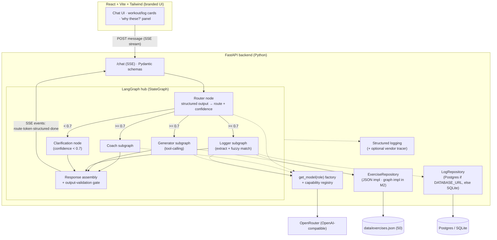
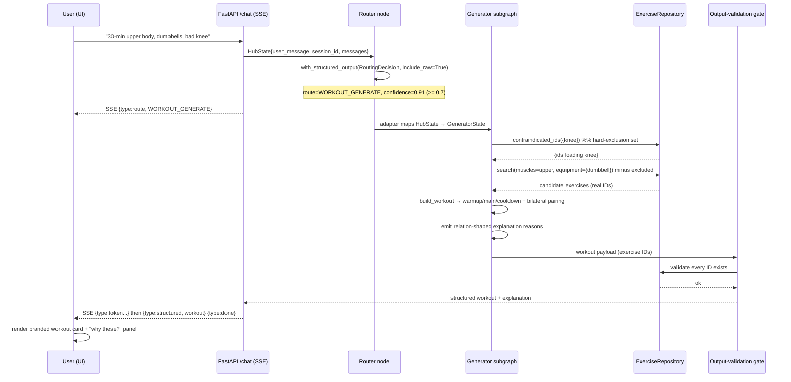

# Architecture — Cadence (Milestone 1)

**Status:** agreed · **Last updated:** 2026-06-02 · **PRD:** [PRD.md](./PRD.md)
**Research:** [docs/research/](./research/) · **ADRs:** [docs/adrs/](./adrs/)

## Executive summary

Cadence M1 is a **multi-agent fitness chat coach**: a Python **LangGraph** hub classifies each user
message with **LLM structured output** (route + confidence) and dispatches to exactly one of three
composed subgraphs — **Coach** (knowledge Q&A), **Workout Generator** (tool-calling over the exercise
dataset), and **Workout Logger** (natural-language → structured, fuzzy-matched log entries). Below a
**0.7 confidence threshold** the hub asks a **clarifying question** instead of guessing. A **FastAPI**
backend exposes the graph over **SSE** to a **premium, Future-branded React/Vite/Tailwind** chat UI.

The three most consequential decisions:

1. **Split topology — FastAPI backend + separate React frontend ([ADR-001](./adrs/ADR-001-split-python-api-react-frontend.md)).**
   Buys the premium branded UI (a P0 centerpiece) and a real client/server API contract that the
   future coach-facing platform (M6) extends rather than retrofits.
2. **Isolated subgraph state + explicit boundary adapters ([ADR-004](./adrs/ADR-004-state-contract-isolated-subgraphs-session-memory.md)).**
   Sidesteps LangGraph's documented silent state-corruption footguns (reducer conflicts, accumulator
   doubling) in exactly the graded code, and makes each subgraph a clean, testable seam.
3. **Forward-compatible seams without over-building ([ADR-008](./adrs/ADR-008-exercise-repository-seam.md),
   [ADR-009](./adrs/ADR-009-injury-as-relationship-hard-exclusion.md),
   [ADR-012](./adrs/ADR-012-explanation-payload-relation-shaped.md)).**
   The exercise **repository interface**, the **injury-as-relationship hard-exclusion** model, and the
   **relation-shaped explanation payload** are the three §7.7 seams that let the M2+ knowledge-graph
   platform graduate as body-swaps, each justified as *essentially free and reversible* — not
   speculative generality.

**Safety invariant (load-bearing):** no user-facing response may reference an exercise outside the
dataset. It's enforced structurally by an **output-validation gate** plus **hard-exclusion** injury
filtering ([ADR-010](./adrs/ADR-010-fuzzy-matching-and-output-validation-gate.md),
[ADR-009](./adrs/ADR-009-injury-as-relationship-hard-exclusion.md)) — the same discipline that becomes
M5's safety-critical contraindication.

**Injury exclusion — two-layer contract (shipped in iteration 02, F-07):** injury hard-exclusion is
a two-layer contract: the search pre-filter (`_execute_search` hides contraindicated exercises from
the model) AND the output gate (`validate_workout` rejects/flags any that reach the payload).
`build_workout`'s `injuries` param guards bilateral-partner inclusion only — it does not re-filter
explicitly-supplied IDs. Future generator changes must preserve both layers; neither alone is the
safety boundary.

**Model layer:** OpenRouter via LangChain `ChatOpenAI` behind a `get_model(role)` factory with a static
**capability registry** + fail-fast startup validation, per-role config
([ADR-007](./adrs/ADR-007-model-abstraction-openrouter-capability-registry.md)) — swap models by config,
and the README's split-test eval story (a committed stretch) runs against it.

**Committed stretch features:** SSE streaming (promoted to P0), dual-path Postgres/SQLite persistence
(promoted), a tiny model-eval harness, a visible "why these?" explanation panel, and coach-voice
polish.

**Key risks:** scope-vs-time for a 2–3h build (mitigated by the PRD's P0/P1/P2 cut-order); LLM
confidence is a routing *signal*, not a calibrated probability (clarify safety-net); OpenRouter
structured-output varies by model (capability registry guards it); the exact Future accent hex is
unconfirmed (flagged for a build-stage eyedropper pass).

## System overview

### Component diagram

The frontend is a thin presentation client — no agent logic, no data access. FastAPI owns the graph
and streams typed SSE events. The hub routes to **exactly one** subgraph per turn (avoiding the
`MULTIPLE_SUBGRAPHS` checkpoint collision); a low-confidence classification diverts to the
clarification node. All exercise access funnels through `ExerciseRepository` (the single point where
the no-hallucination invariant is enforceable); all model access funnels through `get_model(role)`.
Persistence and observability sit behind their own seams.

### Data-flow: a "build me a workout" request

If `search` returns empty/thin (e.g. equipment absent), the Generator takes the **graceful recovery**
path (ADR-006) — acknowledge the gap, offer an alternative, never fabricate. If the model emits an
invalid tool call, the error is appended to state as a `ToolMessage` and the subgraph self-corrects up
to a bounded retry, then degrades gracefully.

## Decision index

| ADR | Decision | Status | Stretch | Contract |
|-----|----------|--------|---------|----------|
| [ADR-001](./adrs/ADR-001-split-python-api-react-frontend.md) | Split topology: FastAPI backend + separate React/Vite/Tailwind frontend | Accepted | no | yes |
| [ADR-002](./adrs/ADR-002-sse-streaming-final-tokens.md) | SSE streaming of final response tokens (safe pattern), stream-ready transport | Accepted | yes | yes |
| [ADR-003](./adrs/ADR-003-langgraph-hub-supervisor-composition.md) | Hub supervisor StateGraph → exactly one of three isolated subgraphs per turn | Accepted | no | no |
| [ADR-004](./adrs/ADR-004-state-contract-isolated-subgraphs-session-memory.md) | Typed state: isolated subgraph schemas, boundary adapters, session-keyed messages | Accepted | no | yes |
| [ADR-005](./adrs/ADR-005-router-structured-output-confidence-clarify.md) | Router via structured output; confidence-gated clarify at 0.7 | Accepted | no | yes |
| [ADR-006](./adrs/ADR-006-resilience-error-feedback-in-state.md) | Resilience: error-feedback-in-state, bounded retries, not RetryPolicy | Accepted | no | no |
| [ADR-007](./adrs/ADR-007-model-abstraction-openrouter-capability-registry.md) | Model abstraction over OpenRouter; per-role config; capability registry | Accepted | no | yes |
| [ADR-008](./adrs/ADR-008-exercise-repository-seam.md) | ExerciseRepository interface (JSON now, graph in M2) | Accepted | no | yes |
| [ADR-009](./adrs/ADR-009-injury-as-relationship-hard-exclusion.md) | Injury avoidance as relation + hard-exclusion pre-filter | Accepted | no | no |
| [ADR-010](./adrs/ADR-010-fuzzy-matching-and-output-validation-gate.md) | Logger fuzzy-match (RapidFuzz WRatio) + output-validation gate | Accepted | no | no |
| [ADR-011](./adrs/ADR-011-log-persistence-postgres-or-sqlite.md) | LogRepository: Postgres when DATABASE_URL set, else SQLite | Accepted | yes | yes |
| [ADR-012](./adrs/ADR-012-explanation-payload-relation-shaped.md) | Relation-shaped explanation payload (M1 trivial, M5 enriches) | Accepted | no | yes |
| [ADR-013](./adrs/ADR-013-frontend-brand-tokens-contract.md) | Brand & voice design contract (Future-inspired tokens) | Accepted | no | yes |
| [ADR-014](./adrs/ADR-014-security-trust-boundary-injection.md) | Trust boundary & injection posture: defense-in-depth via output validation | Accepted | no | no |
| [ADR-015](./adrs/ADR-015-secrets-and-no-auth-m1.md) | Secrets env-only/server-side; M1 deliberately unauthenticated (auth in M6) | Accepted | no | no |
| [ADR-016](./adrs/ADR-016-non-functional-targets.md) | Non-functional targets: latency budgets, perceived-latency via streaming, scale deferred | Accepted | no | no |
| [ADR-017](./adrs/ADR-017-observability-structured-logging.md) | Observability: structured per-request logging + optional vendor tracer (P2) | Accepted | no | no |
| [ADR-018](./adrs/ADR-018-test-strategy-critical-paths.md) | Test strategy: four prioritized critical paths, fake-model seams | Accepted | no | no |
| [ADR-019](./adrs/ADR-019-committed-stretch-features.md) | Committed stretches: eval harness, explanation panel, coach voice | Accepted | yes | no |

**Contract-bearing ADRs** (the roadmap indexes these as shared-contract source-of-truth):
ADR-001 (HTTP chat API), ADR-002 (SSE event envelope), ADR-004 (graph state schema),
ADR-005 (Route enum + RoutingDecision), ADR-007 (model config + capability registry),
ADR-008 (ExerciseRepository), ADR-011 (LogRepository + log entry), ADR-012 (Reason/explanation),
ADR-013 (brand/voice tokens).

## Stretch features

All reflected back into the PRD (v2). Built after P0+P1 core; cut before any core if the budget tightens.

- **SSE streaming (promoted to P0 — ADR-002).** Premium live-typing feel; safe pattern avoids the
  tool-arg streaming-corruption footgun. Impresses on UX; graduates to M6's server-side generation.
- **Dual-path Postgres/SQLite persistence (promoted — ADR-011).** Production-credible DB path while
  keeping clean-clone trivial; seeds M3 history-edge ingestion. Depends on ADR-008's seam pattern.
- **Tiny model-eval harness (ADR-019).** Makes req 24's "how I'd evaluate" *runnable*; demonstrates the
  model abstraction's split-test promise; targets the AI-engineering grader directly. Depends on ADR-007.
- **Visible "why these?" explanation panel (ADR-019, ADR-012).** Surfaces the relation-shaped
  explanation; previews M5's headline explainability and the market's KG-contraindication whitespace.
- **Coach voice/personality polish (ADR-019, ADR-013).** Cohesive coach personality; plays to Future's
  human-coach brand.

## Non-goals

(Mirrors PRD §4 Out-of-Scope/Deferred, after the v2 promotions.)

- **No auth / multi-user / per-member data isolation in M1** — single-user demo over synthetic data;
  auth enters in M6 (ADR-015).
- **No nutrition, scheduling, real human coaches, payment, or onboarding** — out of product scope.
- **No exercise data beyond the 50-entry dataset; no external exercise APIs.**
- **No cross-session multi-user history** — durable single-store persistence is in (ADR-011), but
  per-member identity/history is deferred to M6.
- **No knowledge graph, GraphRAG, vector store, or Neo4j in M1** — those are M2+; M1 only *shapes its
  seams* to graduate (ADR-008/009/012). Building any graph infrastructure now would be the
  over-engineering the PRD §8.8 forbids.
- **No horizontal scale / concurrency machinery** — single-instance for M1 (ADR-016).

## Integration lessons

### Hub `_router_node` is a convergence hotspot (iteration 03, P2)

The hub `_router_node` is where conversation context (multi-turn input assembly) and call-site
instrumentation (tracing wrapper) both touch the same few lines. When two features land in one
iteration that each edit this code path — one building the multi-turn message list, one wrapping the
model call in an `obs.llm_call` context — the integrator must **combine** both behaviors (build the
multi-turn input *inside* the obs context manager), never pick a side. A side-pick passes both
features' scoped tests yet silently drops one concern at the integration boundary.

**Mitigation:** Consider making the router input-assembly and the tracing wrapper structurally
separable — e.g. extract `_build_router_input(state)` and `_timed_router_invoke(input)` as
distinct helpers — so future edits to either concern don't require touching the same lines. This
makes the integration merge mechanical rather than semantic.

## Open questions

- **Exact Future accent hex** is unconfirmed (not exposed in site HTML) — a build-stage eyedropper
  pass against the live site locks the token (ADR-013).
- **0.7 confidence threshold** is a starting value; tune against the ambiguous routing test cases
  during build (ADR-005, PRD §8.5).
- **RapidFuzz `score_cutoff=80`** is the research default; confirm against the logger test cases
  (ADR-010).
- **Whether the logger's LLM-verify step is on by default** vs. pure-deterministic — decide at build
  based on accuracy on the test inputs (ADR-010); tests can force deterministic mode.
- **Several LangGraph footgun claims are low-confidence / version-dependent** (accumulator doubling,
  streaming corruption) — the mitigations are cheap insurance regardless, but reproduce against the
  pinned LangGraph version during build (TECHNOLOGY.md caveats).
